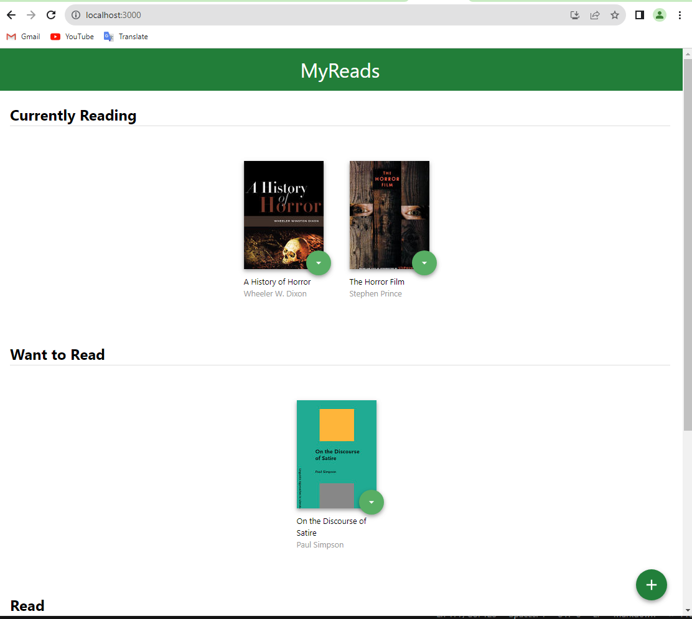
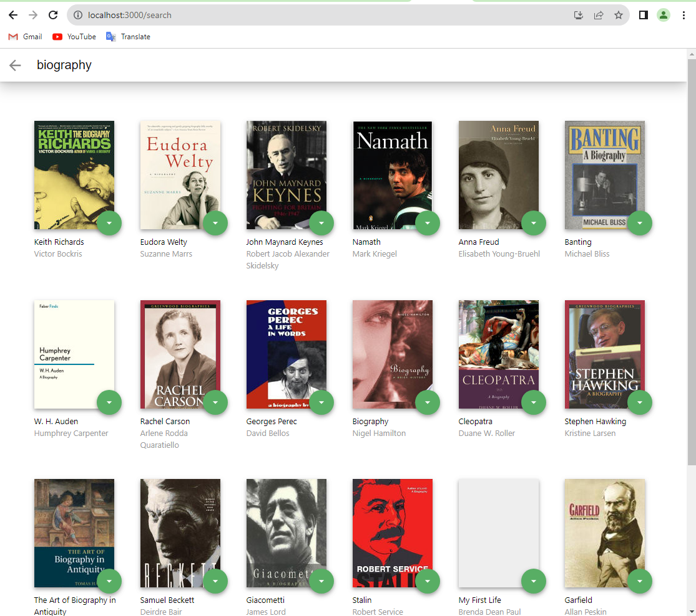

# A Book Tracking App Project
The 'A Book Tracking App' project will allow users to manage their personal library and keep track of books they are currently reading, want to read, and have already read. The interface will be user-friendly and easy to use, providing basic functionalities for book management.

## Project Overview

A book tracking app built with React / Bookshelf app that allows you to select and categorise books you have read, are currently reading, or want to read.

**App Functionality**

In this application, the main page displays a list of "shelves" (i.e. categories), each of which contains a number of books. The three shelves are:

* Currently Reading
* Want to Read
* Read

Each book has a control that lets you select the shelf for that book. When you select a different shelf, the book moves there. Note that the default value for the control should always be the current shelf the book is in.

The main page also has a link to /search, a search page that allows you to find books to add to your library.

The search page has a text input that may be used to find books. As the value of the text input changes, the books that match that query are displayed on the page, along with a control that lets you add the book to your library. To keep the interface consistent, you may consider re-using some of the code you used to display the books on the main page.

When a book is on a bookshelf, it should have the same state on both the main application page and the search page.

The search page also has a link to / (the root URL), which leads back to the main page.

When you navigate back to the main page from the search page, you should instantly see all of the selections you made on the search page in your library.

We are given a [starter template](https://github.com/udacity/reactnd-project-myreads-starter) If you choose to start with this template, your job will be to add interactivity to the app by refactoring the static code in this template.

To get started developing right away:

* install all project dependencies with `npm install`
* start the development server with `npm start`

Of course, you are free to start this project from scratch if you wish! Just be sure to use [Create React App](https://github.com/facebookincubator/create-react-app) to bootstrap the project.

## Backend Server

To simplify your development process, we've provided a backend server for you to develop against. The provided file [`BooksAPI.js`](src/BooksAPI.js) contains the methods you will need to perform necessary operations on the backend:

- [`getAll`](#getall)
- [`update`](#update)
- [`search`](#search)

### `getAll`

Method Signature:

```js
getAll();
```

- Returns a Promise which resolves to a JSON object containing a collection of book objects.
- This collection represents the books currently in the bookshelves in your app.

### `update`

Method Signature:

```js
update(book, shelf);
```

- book: `<Object>` containing at minimum an `id` attribute
- shelf: `<String>` contains one of ["wantToRead", "currentlyReading", "read"]
- Returns a Promise which resolves to a JSON object containing the response data of the POST request

### `search`

Method Signature:

```js
search(query);
```

- query: `<String>`
- Returns a Promise which resolves to a JSON object containing a collection of a maximum of 20 book objects.
- These books do not know which shelf they are on. They are raw results only. You'll need to make sure that books have the correct state while on the search page.

## Important

The backend API uses a fixed set of cached search results and is limited to a particular set of search terms, which can be found in [SEARCH_TERMS.md](SEARCH_TERMS.md). That list of terms are the _only_ terms that will work with the backend, so don't be surprised if your searches for Basket Weaving or Bubble Wrap don't come back with any results.


## How To Run This App

**Dependencies**

 * npm
1. Download or Clone this Repository(https://github.com/quangkha91/Udacity-React-ABookTracking.git).
2. Run `$ npm install` to install the project dependencies.
3. Run the app using `$ npm start`.
4. App can be seen at: localhost:3000.

# Directory Structure of source code
```bash
├── README.md - This file.
├── .gitignore
├── package-lock.json
├── package.json # npm package manager file. It's unlikely that you'll need to modify this.
└── public
    ├── favicon.ico # React Icon, You may change if you wish.
    ├── index.html # DO NOT MODIFY
    ├── logo192.png
    ├── logo512.png
    ├── manifest.json
    ├── robots.txt
└── src
    ├── App.css # Styles for your app. Feel free to customize this as you desire.
    ├── App.js # This is the root of your app. Contains static HTML right now.
    ├── App.test.js # Used for testing. Provided with Create React App. Testing is encouraged, but not required.
    └── components
        ├── Book.js # Component for book item
        ├── BookShelfChanger.js # Component for book shelf changer
        ├── BookShelve.js # Component for book shelve
        ├── ListBooks.js # Component for list book
    └── icons # Helpful images for your app. Use at your discretion.
        ├── add.svg
        ├── arrow-back.svg
        ├── arrow-drop-down.svg
    ├── index.css # Global styles. You probably won't need to change anything here.
    ├── index.js # You should not need to modify this file. It is used for DOM rendering only.
    ├── logo.svg
    └── pages
        ├── Home.js # Component for home page
        ├── Search.js # Component for search page
    ├── reportWebVitals.js
    ├── setupTests.js
    └── utils
        ├── BooksAPI.js # A JavaScript API for the provided Udacity backend. Instructions for the methods are below.
        └── Constants.js # Contain constants.
```

## Requirements

**Meets Specifications**

### Application Setup

* The application was created with create-react-app and requires only npm install and npm start to get it installed and launched.

* An updated README that describes the project and has instructions for installing and launching the project is included.

### Main Page

* The main page shows 3 shelves for books, and each book is shown on the correct shelf.

* The main page shows a control that allows users to move books between shelves. The control should be tied to each book instance. The functionality of moving a book to a different shelf works correctly.

* When the browser is refreshed, the same information is displayed on the page.

### Search Page

1. The search page has a search input field.

2. The search page behaves correctly:

    a) As the user types into the search field, books that match the query are displayed on the page.

    b) Search results are not shown when all of the text is deleted out of the search input box.

    c) Invalid queries are handled and prior search results are not shown.

    d) The search works correctly when a book does not have a thumbnail or an author. (To test this, try searching for "poetry" and "biography").

    e) The user is able to search for multiple words, such as “artificial intelligence.”

* Search results on the search page allow the user to select “currently reading”, “want to read”, or “read” to place the book in a certain shelf.

* If a book is assigned to a shelf on the main page and that book appears on the search page, the correct shelf should be selected on the search page. If that book's shelf is changed on the search page, that change should be reflected on the main page as well. The option "None" should be selected if a book has not been assigned to a shelf.

* When an item is categorized on the search page and the user navigates to the main page, it appears on that shelf in the main page.

### Routing

* The main page contains a link to the search page. When the link is clicked, the search page is displayed and the URL in the browser’s address bar is /search.

* The search page contains a link to the main page. When the link is clicked, the main page is displayed and the URL in the browser’s address bar is /.

### Code Functionality

* Component state is passed down from parent components to child components. The state variable is not modified directly - setState() function is used correctly.

* Books have the same state on both the search page and the main application page: If a book is on a bookshelf, that is reflected in both locations.

* All JSX code is formatted properly and functional.

##### Screenshots of Finished Project





### License

This project is licensed under the [MIT License](LICENSE) - see the [LICENSE](LICENSE) file for details.

Giấy Phép MIT (MIT)

[Toàn Bộ Văn Bản Giấy Phép](https://opensource.org/licenses/MIT)